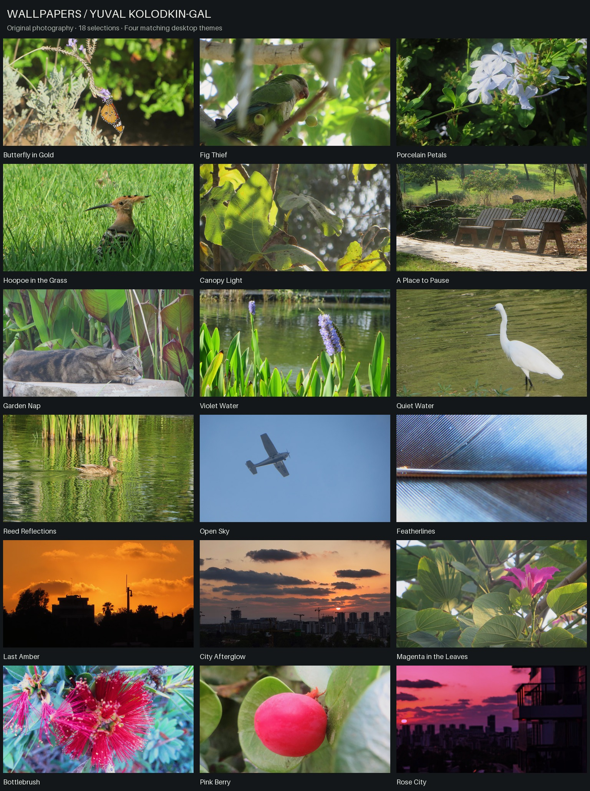

# Wallpapers by Yuval Kolodkin-Gal

**All photographs taken by [Yuval Kolodkin-Gal](https://github.com/yuvalkolodkingal).**

Eighteen original photographs, curated and edited for the desktop, with four
matching Hyprland / Omarchy themes. Wildlife, garden light, water, and city
sunsets. Local color, exposure, and crop adjustments preserve the original scenes.



## Quick install

**Linux / macOS / Unix** (Bash, curl, tar, Python 3.11+):

```sh
curl -fsSL https://raw.githubusercontent.com/yuvalkolodkingal/Wallpapers/main/install.sh | bash
```

**Windows PowerShell** (5.1+; no Python needed):

```powershell
& ([scriptblock]::Create((irm 'https://raw.githubusercontent.com/yuvalkolodkingal/Wallpapers/main/install.ps1')))
```

Installs the four themes on Omarchy/Hyprland, or the wallpapers on other desktops.
Choose images in your wallpaper settings; installation does not switch your
desktop automatically. [Installer options and platform setup](docs/INSTALL.md)
include theme selection, full-resolution downloads, and optional Omarchy activation.

## Browse and download

Clone this repo and open [index.html](index.html) in a browser for the offline
gallery, theme filters, full-size previews, and downloads. On GitHub, use the
image folders below or the per-photo links further down.

- [1920×1080 wallpapers](wallpapers/1920x1080): all 18 images, ready for a Full HD display.
- [Full-resolution masters](wallpapers/master): sixteen 3840×2160 images and two
  2992×1683 images. Nothing is upscaled.
- [Editing notes](docs/EDITING.md) and [reproducible recipes](metadata/recipes.json).

```sh
git clone https://github.com/yuvalkolodkingal/Wallpapers.git
cd Wallpapers
xdg-open index.html
```

## Themes

| Theme | Palette | Photographs |
| --- | --- | --- |
| **Canopy** | Forest, leaf green, warm gold | Butterfly, parakeet, flowers, hoopoe, canopy, garden chairs, sleeping cat |
| **Lagoon** | Deep teal, sage, lavender | Pond flowers, egret, duck, open sky, feather texture |
| **Ember** | Warm charcoal, amber, coral | Amber skyline and city afterglow |
| **Dusk** | Deep plum, rose, lavender | Magenta flowers, bottlebrush, pink berry, rose city |

Theme setup and installer instructions are in [docs/THEMES.md](docs/THEMES.md).
Themes include current Hyprland Lua configs and legacy Hyprlang snippets. The theme directories include matching
backgrounds and palettes for Omarchy's app-theme generation.

Preview or install all four themes:

```sh
python3 scripts/theme.py list
python3 scripts/theme.py install all --dry-run
python3 scripts/theme.py install all
```

To activate one after installation:

```sh
python3 scripts/theme.py apply canopy
```

The installed names are `ykg-canopy`, `ykg-lagoon`, `ykg-ember`, and `ykg-dusk`.
See the theme guide for existing-theme protection and installation paths.

Creating or cloning the repo does not change the running desktop. Apply a theme
only when you want to switch it; use the documented installer first.

## Photographs

| Photograph | Theme | Full HD | Master |
| --- | --- | --- | --- |
| [Butterfly in Gold](previews/butterfly-in-gold.jpg) | Canopy | [1920×1080](wallpapers/1920x1080/butterfly-in-gold.jpg) | [3840×2160](wallpapers/master/butterfly-in-gold.jpg) |
| [Fig Thief](previews/fig-thief.jpg) | Canopy | [1920×1080](wallpapers/1920x1080/fig-thief.jpg) | [3840×2160](wallpapers/master/fig-thief.jpg) |
| [Porcelain Petals](previews/porcelain-petals.jpg) | Canopy | [1920×1080](wallpapers/1920x1080/porcelain-petals.jpg) | [3840×2160](wallpapers/master/porcelain-petals.jpg) |
| [Hoopoe in the Grass](previews/hoopoe-in-the-grass.jpg) | Canopy | [1920×1080](wallpapers/1920x1080/hoopoe-in-the-grass.jpg) | [3840×2160](wallpapers/master/hoopoe-in-the-grass.jpg) |
| [Canopy Light](previews/canopy-light.jpg) | Canopy | [1920×1080](wallpapers/1920x1080/canopy-light.jpg) | [3840×2160](wallpapers/master/canopy-light.jpg) |
| [A Place to Pause](previews/a-place-to-pause.jpg) | Canopy | [1920×1080](wallpapers/1920x1080/a-place-to-pause.jpg) | [3840×2160](wallpapers/master/a-place-to-pause.jpg) |
| [Garden Nap](previews/garden-nap.jpg) | Canopy | [1920×1080](wallpapers/1920x1080/garden-nap.jpg) | [3840×2160](wallpapers/master/garden-nap.jpg) |
| [Violet Water](previews/violet-water.jpg) | Lagoon | [1920×1080](wallpapers/1920x1080/violet-water.jpg) | [3840×2160](wallpapers/master/violet-water.jpg) |
| [Quiet Water](previews/quiet-water.jpg) | Lagoon | [1920×1080](wallpapers/1920x1080/quiet-water.jpg) | [3840×2160](wallpapers/master/quiet-water.jpg) |
| [Reed Reflections](previews/reed-reflections.jpg) | Lagoon | [1920×1080](wallpapers/1920x1080/reed-reflections.jpg) | [3840×2160](wallpapers/master/reed-reflections.jpg) |
| [Open Sky](previews/open-sky.jpg) | Lagoon | [1920×1080](wallpapers/1920x1080/open-sky.jpg) | [3840×2160](wallpapers/master/open-sky.jpg) |
| [Featherlines](previews/featherlines.jpg) | Lagoon | [1920×1080](wallpapers/1920x1080/featherlines.jpg) | [3840×2160](wallpapers/master/featherlines.jpg) |
| [Last Amber](previews/last-amber.jpg) | Ember | [1920×1080](wallpapers/1920x1080/last-amber.jpg) | [2992×1683](wallpapers/master/last-amber.jpg) |
| [City Afterglow](previews/city-afterglow.jpg) | Ember | [1920×1080](wallpapers/1920x1080/city-afterglow.jpg) | [3840×2160](wallpapers/master/city-afterglow.jpg) |
| [Magenta in the Leaves](previews/magenta-in-the-leaves.jpg) | Dusk | [1920×1080](wallpapers/1920x1080/magenta-in-the-leaves.jpg) | [3840×2160](wallpapers/master/magenta-in-the-leaves.jpg) |
| [Bottlebrush](previews/bottlebrush.jpg) | Dusk | [1920×1080](wallpapers/1920x1080/bottlebrush.jpg) | [3840×2160](wallpapers/master/bottlebrush.jpg) |
| [Pink Berry](previews/pink-berry.jpg) | Dusk | [1920×1080](wallpapers/1920x1080/pink-berry.jpg) | [2992×1683](wallpapers/master/pink-berry.jpg) |
| [Rose City](previews/rose-city.jpg) | Dusk | [1920×1080](wallpapers/1920x1080/rose-city.jpg) | [3840×2160](wallpapers/master/rose-city.jpg) |

## Reproducibility

Every selection has a source checksum and exact crop/grade settings in
`metadata/recipes.json`; published master checksums are in
`metadata/collection.json`. See [the rendering instructions](docs/EDITING.md#reproduce-or-revise)
to rebuild from the original source folders. `uv.lock` fixes processing dependencies.

```sh
uv sync --locked
uv run scripts/verify_collection.py
```

## Credit

Photography © 2026 **Yuval Kolodkin-Gal**. All rights reserved.
Artist and copyright credit are embedded in the wallpaper JPEGs. Original
location, capture-time, and device metadata are omitted from exports.
See [COPYRIGHT](COPYRIGHT) for the rights notice.
